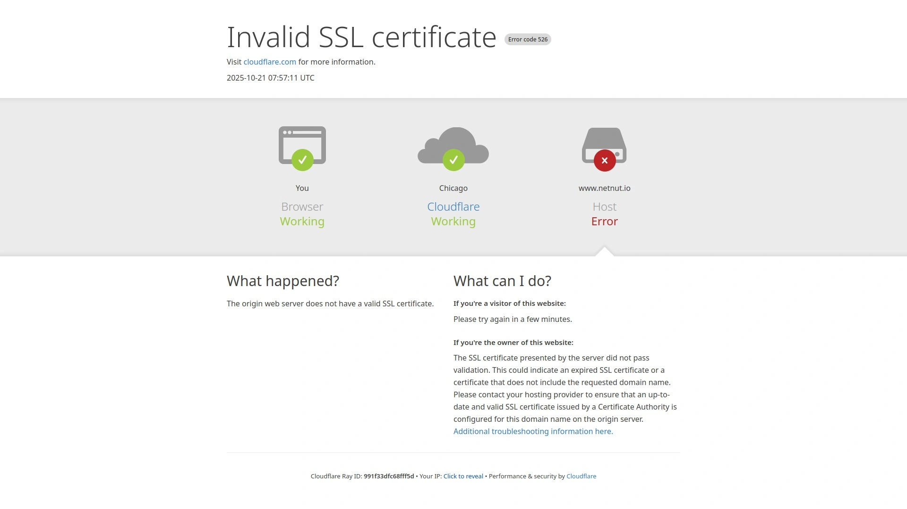

# 15 Best Residential Proxies & ISP Proxies for Web Scraping & Market Research (2025)

When businesses need reliable web data collection, the right proxy network becomes essential. Residential and ISP proxies enable companies to bypass geo-restrictions, avoid IP blocks, and gather public data at scale without getting flagged. Whether you're handling market research, price monitoring, ad verification, or brand protection, choosing a provider that combines performance, stability, and affordability matters significantly.

This guide reviews the leading residential proxy providers that deliver across multiple use cases, from enterprise-scale operations to startup budgets, helping you identify the best fit for your data collection needs.

## [ProxyShare](https://www.proxyshare.com)

Massive IP pool with global reach, designed for undetected scraping at every scale.

ProxyShare operates a network of 75 million residential IPs across 195+ locations, making it straightforward to access geo-restricted content and conduct large-scale data collection. The platform offers multiple proxy types including rotating residential, static residential, unlimited residential options, static data center, and ISP proxies. Each variant serves different speed, stability, and anonymity requirements. With protocols supporting both HTTP and SOCKS5, ProxyShare handles everything from standard web requests to complex data extraction workflows.

The service emphasizes unblocked access without CAPTCHA interruptions or IP bans. Users can perform city-level targeting across their entire network, enabling precise geographic filtering for localized research tasks. Pricing starts competitively at $1.54/GB for high-volume purchases, with flexible monthly plans scaling from 10GB trial options to enterprise custom solutions. The dashboard provides straightforward session management, IP rotation controls, and real-time geolocation selection, though ProxyShare maintains strict ethical sourcing standards that limit availability in mainland China for policy compliance reasons.

## [Bright Data](https://www.brightdata.com)

Enterprise-grade proxy platform with 150+ million IPs and advanced scraping infrastructure.

Bright Data emerged as the industry pioneer when it introduced residential proxies to the mainstream market through its original Luminati Networks brand. The company now operates one of the world's largest and most diversified proxy ecosystems, serving over 20,000 clients including Fortune 500 companies. With 150 million residential IPs, 700,000 ISP proxies, 770,000 datacenter IPs, and 7 million mobile proxies spanning 195 countries, Bright Data covers virtually every data collection scenario. The platform includes advanced features like dedicated residential IPs for exclusive access, IPv6-only pools for modern compatibility, and IP caching that reduces costs by returning previously-accessed pages.

Beyond proxies, Bright Data offers specialized APIs for 200+ websites, a cloud-based web scraping IDE, browser extensions, and pre-collected datasets covering e-commerce, real estate, and other sectors. Pricing reflects enterprise positioning with premium features and guaranteed uptime, though the company recently introduced pay-as-you-go plans starting at $5/GB to serve smaller operations. The strict customer vetting and compliance-first approach ensure legal operation for legitimate use cases while supporting academic institutions, non-profits, and government agencies through the Bright Initiative scholarship program.

## [Oxylabs](https://www.oxylabs.io)

Balanced performance and features with 100+ million residential IPs and specialized API services.

Oxylabs delivers comprehensive proxy solutions for mid-market and enterprise clients seeking reliability without excessive complexity. The network includes 100 million residential IPs, 20 million mobile proxies, 2 million ISP proxies, and dedicated datacenter options across 188 countries. Performance testing consistently places Oxylabs among top-tier providers with 99.95% success rates and response times around 0.6 seconds globally. The provider combines traditional gateway-based proxy access with sophisticated APIs for SERP results, LinkedIn data, and e-commerce scraping, making it suitable for specialized intelligence gathering alongside general web scraping.

Integration flexibility stands out through both standard proxy protocols and specialized API endpoints tailored for challenging targets. Users access free advanced geo-targeting including country, state, city, and ASN-level filtering without premium surcharges. Customer support includes dedicated account managers for larger accounts and 24/7 professional support via live chat. Pricing starts from $8/GB on pay-as-you-go plans with enterprise negotiation available for substantial commitments, positioning Oxylabs as a premium choice with measurable performance advantages over budget alternatives.

## [IPRoyal](https://www.iproyal.com)

Ethically-sourced proxies with competitive pricing and real-time IP rotation controls.

IPRoyal addresses the common frustration of excessive complexity by emphasizing straightforward pricing and user-friendly interfaces. The provider maintains 32 million residential IPs from ethically-vetted sources, 500,000 ISP proxies, and 2.5 million mobile IPs across 195 countries. Static residential proxies begin at just $2/IP with unlimited traffic allocation, while rotating residential options start at $1.75/GB including transparent country, state, and city-level targeting. The platform distinguishes itself by offering non-expiring traffic that stays active until consumed, plus flexible rotation controls allowing sticky sessions lasting up to seven days or randomized IP changes with every request.

User experience priorities include minimal dashboard complexity, straightforward API documentation, and responsive customer support through live chat and email. IPRoyal deliberately avoids hidden fees or complicated terms while providing competitive features like unlimited concurrent sessions and SOCKS5 protocol support. The ethical sourcing emphasis, reinforced through partnerships with verified ISP providers, creates fewer account restrictions compared to certain competitors. This combination of affordability, transparency, and ethical operation makes IPRoyal particularly attractive for startups and mid-size companies scaling data collection operations.

## [Webshare](https://www.webshare.io)

Budget-friendly platform with flexible payment models and strong beginner support.

Webshare provides among the most accessible entry points for residential proxy users, offering 10 free proxies without credit card requirements and transparent pay-as-you-go pricing starting at just $0.30/IP for static residential options. The platform maintains ethical sourcing practices focused on Tier A model proxies, ensuring quality despite aggressive pricing. Users access 50,000+ residential IPs with both HTTP and SOCKS5 support, plus intuitive configuration methods through direct connections, rotating endpoints, or backbone integrations. Static residential proxies include unlimited bandwidth and are particularly suitable for maintaining persistent sessions during account management, brand protection, or SEO tracking tasks where consistent identity matters.

The dashboard emphasizes simplicity over enterprise complexity, making Webshare ideal for individuals, agencies, and small teams entering web scraping. Rotating endpoints provide free automatic IP rotation for users unwilling to manage complex gateway configurations. Documentation includes practical setup guides for popular third-party tools, and responsive customer support helps resolve issues quickly. The recent 50% promotional pricing on rotating residential proxies creates compelling timing for budget-conscious projects seeking reliable service without enterprise overhead or multi-month commitments.

## [Smartproxy (Decodo)](https://www.smartproxy.org)

Rapidly expanding provider with 100+ million IPs, mobile proxies, and integrated scraping tools.

Smartproxy (now operating under the Decodo brand) transformed from a basic proxy provider into a comprehensive data collection platform through aggressive innovation and feature expansion. The network includes 100+ million residential IPs, 10+ million mobile IPs, thousands of datacenter options, and ISP proxies spanning 195+ countries. Advanced targeting enables precision down to city and ISP levels for residential proxies, with dedicated infrastructure gateways in multiple regions ensuring low-latency routing. The platform achieves competitive performance metrics including 99.5% success rates and response times averaging 0.6 seconds or better, matching premium competitors while maintaining budget-friendly pricing.

Beyond proxies, Smartproxy bundles site unblocker tools, web scraping APIs, a no-code scraper interface, an antidetect browser, and proxy checker utilities—essentially providing an entire infrastructure layer for automated data collection. The "Smart Plan Recommendation" tool guides users toward appropriate service tiers by analyzing stated use cases, reducing confusion around option selection. Award-winning 24/7 customer support operates in multiple languages including English and Chinese, ensuring rapid response regardless of timezone. Pricing remains accessible with rotating residential options starting at $7/GB while offering cost reductions to $1.75/GB at scale, creating favorable economics for growing operations.

## [SOAX](https://www.soax.com)

Specialized provider excelling at enterprise-scale operations with 155+ million residential IPs.

SOAX emerged from focused development targeting enterprise clients requiring massive IP pools and excellent uptime rather than user-friendly dashboards. The network includes 155 million residential IPs, 30 million mobile IPs, and 2.6 million ISP proxies providing one of the largest rotating networks alongside Bright Data. Performance testing by independent researchers consistently ranks SOAX among top performers with 99.55% success rates and 0.55-second response times across major markets. The platform emphasizes reliability with 99.9% uptime guarantees and infrastructure designed to handle thousands of concurrent requests without degradation.

SOAX primarily serves businesses engaged in large-scale market research, competitive intelligence, and comprehensive data aggregation where reliability trumps cost considerations. The provider implements request-based pricing models allowing charges only for successful data retrieval rather than raw traffic consumption—an important distinction for operations with variable success rates. Advanced features include carrier and ASN-level targeting for mobile proxies plus city-specific residential IP filtering across worldwide locations. Support remains available 24/7 for enterprise tiers, though SOAX doesn't maintain free trial access, requiring commitment through either large paid plans or direct sales discussions.

## [Infatica](https://www.infatica.io)

Performance-focused provider with 15 million IPs and fastest response times in testing.

Infatica prioritizes raw performance metrics over network size, achieving best-in-category response speeds averaging just 0.32 seconds for UK requests during independent benchmarking. The residential proxy network includes 15+ million IPs across worldwide locations with clean IP quality ratings and infrastructure optimized for speed. Features include customizable rotation periods ranging from 5 to 60 minutes, sticky sessions enabling persistent browsing, and flexible authentication through credentials or IP whitelisting. The gateway architecture with distributed servers in the US, Europe, and Asia ensures efficient routing regardless of geolocation targets.

Pricing starts exceptionally affordably at $0.30/GB for rotating residential proxies with volume discounts available, making Infatica particularly competitive for bandwidth-intensive operations. The recent 50% pricing reduction compared to previous tiers improved market positioning substantially. Users appreciate the straightforward feature set, transparent usage tracking through real-time dashboards, and responsive 24/7 support with SLA-guaranteed response times. Limitations include restricted SOCKS5 support (TCP only) and no advanced features like ASN-level geotargeting, positioning Infatica as optimal for straightforward web scraping and data collection rather than specialized targeting requirements.

## [Nimble](https://www.nimbleway.com)

AI-powered proxy platform with lightning-fast 0.25-second response times and intelligent IP selection.

Nimble represents the latest generation of proxy infrastructure incorporating machine learning for IP optimization, addressing traditional challenges around detection and blocking through algorithmic rather than brute-force approaches. The residential proxy network uses AI engines to intelligently select IPs based on target characteristics, dramatically improving success rates on sophisticated anti-bot systems. Response times average just 0.25 seconds globally—among the fastest measurable in the industry—enabling real-time applications requiring immediate data retrieval. Features include both rotating and sticky IP options, geosessions maintaining consistent location identities for multi-week periods, and granular country/state/city targeting.

Nimble offers additional tools beyond proxies including SERP API, e-commerce API, maps API, and browsers with captcha-solving integration—positioning the platform as a complete data collection infrastructure rather than simple proxy access. Pricing begins from $6.10/GB on annual commitments with pay-as-you-go options at $8/GB, supported by enterprise plans featuring dedicated account managers and custom SLA arrangements. The platform recently added enterprise-grade analytics enabling budget control, project organization, and usage visibility essential for larger operations. Free trial access for 7 days allows evaluation before commitment, though newer market entry means smaller network size compared to established competitors.

## [NetNut](https://www.netnut.io)

Enterprise-focused provider combining premium features with high-volume residential IPs spanning 155+ countries.

NetNut targets businesses handling substantial data collection needs where integration complexity and professional support justify premium pricing. The network includes 52+ million residential IPs, 150,000+ datacenter proxies, and 1 million mobile IPs with emphasis on performance optimization for enterprise use cases. Features include automatic IP rotation, customizable sticky sessions, unlimited concurrency, and interactive dashboards providing real-time proxy management and usage insights. Gateway architecture distributes traffic efficiently across global regions, achieving competitive performance metrics while maintaining excellent uptime.

The provider emphasizes professional integration support through dedicated account managers for qualifying customers, ensuring complex implementations receive appropriate technical guidance. Request-based pricing models charge only for successful data retrieval rather than raw bandwidth, aligning costs with actual results—an important distinction for projects with variable success rates. NetNut specializes in providing substantial IP volumes (minimum packages start around $300/month for 20GB), positioning it strictly for enterprise and growth-stage operations rather than budget-conscious startups. The company serves Fortune 500 clients, universities, and major research institutions, reflecting the professional positioning and enterprise-grade infrastructure underpinning all services.

## [Rayobyte](https://www.rayobyte.com)

Veteran provider emphasizing ethical sourcing and affordability with 36+ million residential IPs.

Rayobyte emerged as a stable, long-term player in the proxy market, celebrating over a decade of continuous operation while maintaining profitability through conservative pricing and ethical practices. The residential proxy network includes 36+ million ethically-sourced IPs across approximately 180 countries, with emphasis on sourcing transparency through the company's Cash Raven program documenting ethical acquisition practices. Pricing begins exceptionally low at $0.90/GB for high-volume purchases, making Rayobyte attractive for cost-focused operations, though initial pricing at $3.50/GB reflects moderate positioning for smaller commitments.

Features include country, state, and city-level targeting, sticky sessions up to 120 minutes, unlimited threads, and flexible pricing models from pure pay-as-you-go to tiered monthly subscriptions. The provider offers non-expiring traffic accumulating indefinitely until consumed, plus transparent cost tracking through comprehensive dashboards. Limitations include HTTP-only protocol support (no SOCKS5), slower response times compared to modern competitors (around 2.5 seconds in testing), and less granular filtering compared to premium providers. Despite these constraints, Rayobyte's combination of ethical sourcing, transparent operations, and aggressive cost positioning attracts volume buyers prioritizing affordability over performance excellence.

## [Decodo (Static Residential)](https://www.decodo.com)

Flexible proxy platform combining static and rotating options with shared or dedicated IP choices.

Decodo (formerly Smartproxy) provides nuanced proxy offerings distinguishing between shared and dedicated static IP models, serving both budget-conscious operations and projects requiring exclusive IP access. The platform offers static residential proxies from premium ASN providers with dedicated options exclusively allocated to individual customers, eliminating competition for bandwidth. Pay-per-GB models start at just $0.27/IP for shared arrangements while dedicated static IPs command $2+ pricing reflecting exclusive access. The combination enables users to choose appropriate cost/exclusivity tradeoffs based on specific requirements.

Features include 99.99% uptime guarantees, sub-0.2-second response times, flexible traffic options, premium ASN sourcing, and 24/7 technical support. Geographic targeting spans North/South Americas, Europe, and APAC regions with country and city precision. The platform appeals to users requiring persistent browsing sessions without constant re-authentication—critical for account management, price monitoring, and situations where consistent identity matters more than anonymity. Pricing transparency and flexible commitment terms (14-day money-back guarantee) reduce adoption friction for new users evaluating options before full-scale deployment.

## [ProxyEmpire](https://www.proxyempire.io)

Straightforward ISP proxy specialist providing static residential access in 21+ countries.

ProxyEmpire specializes explicitly in ISP proxies—static residential addresses ideal for applications requiring persistent identity rather than constant rotation. The network includes millions of residential IPs with dedicated assignment options enabling exclusive IP allocation for specified periods ranging from hours to months. Pricing reflects competitive market positioning while offering flexibility between short-term and extended commitments. Features include HTTP and SOCKS5 protocol support, geolocation targeting at country, region, and ISP levels, plus quality IP testing ensuring reliability over assignment periods.

The platform serves applications like long-term account management, content access requiring login persistence, SEO analytics with consistent tracking identity, and price monitoring needing stable reference points. Use case documentation emphasizes professional applications while maintaining ethical sourcing standards. Integration simplicity and straightforward dashboard interfaces appeal to users prioritizing ease-of-use over feature breadth, making ProxyEmpire suitable for specific use cases rather than general-purpose proxy requirements. The narrow market focus enables deep optimization for ISP proxy delivery without distraction from competing service offerings.

## [PacketStream](https://www.packetstream.io)

Peer-to-peer network enabling individuals to monetize bandwidth while businesses access affordable residential IPs.

PacketStream operates fundamentally differently from traditional proxy providers through peer-to-peer architecture connecting bandwidth buyers with individuals earning money by sharing unused internet connections as sellers. This model provides authentic residential IPs from real home connections while offering cost advantages compared to centralized provisioning. The network spans 45+ million residential IPs across 102 countries, though exact pool sizes fluctuate based on active peer participation. Pricing emphasizes affordability through pay-as-you-go models starting at just $0.10/GB—among the lowest in the industry.

Features include HTTP and HTTPS protocol support with optional SOCKS proxy configurations, country-level geographic targeting (though not city-level precision), and API access enabling automation. The platform appeals to cost-conscious developers and small businesses willing to tolerate less predictable availability in exchange for exceptional pricing. Response times vary based on peer connection quality, and occasional IP availability constraints may impact operations requiring large-scale concurrent access. The peer-to-peer model also introduces minor complexity around session management compared to traditional gateway architectures, though documented integration guides simplify setup for most applications.

## [Massive](https://www.massivedata.io)

Next-generation provider emerging with AI-driven infrastructure and 400% revenue growth demonstrating rapid adoption.

Massive represents the emerging category of AI-first proxy platforms designed specifically for modern use cases including large language model training, AI model optimization, and machine learning data pipelines. The provider achieved remarkable 400% revenue growth in its first complete operational year, signaling strong market demand for performance-optimized infrastructure. The platform combines residential, mobile, and ISP proxy access with intelligent IP selection algorithms that adapt to target characteristics, improving success rates against sophisticated anti-bot defenses.

The company emphasizes compliance certification and ethical sourcing standards appealing to enterprises requiring strict governance. Feature offerings include advanced geotargeting, real-time performance monitoring, and usage analytics providing granular visibility into data collection operations. Pricing reflects competitive positioning competitive with established providers while adding AI optimization premiums for sophisticated detection avoidance. Market research indicates Massive consistently delivers superior performance in critical markets like the US where many competitors struggle, achieving 99.87% success rates compared to median industry performance of 99.56%.

## Frequently Asked Questions

**What's the difference between residential and ISP proxies?**

Residential proxies route traffic through real home internet connections, appearing virtually identical to legitimate user traffic while being slower and less consistent. ISP proxies combine residential IP addresses assigned by internet service providers with high-speed datacenter hosting, providing faster performance than pure residential while maintaining better anonymity than datacenter-only proxies. ISP proxies excel for use cases requiring persistent identity and speed, while residential proxies prioritize anonymity and detection avoidance.

**How do I choose the right proxy provider for my use case?**

Evaluate specific needs: speed requirements, geographic targeting precision, concurrent request capacity, budget constraints, and success rate thresholds. Enterprise applications prioritizing reliability and support align better with premium providers like Bright Data or Oxylabs. Cost-sensitive operations benefit from budget alternatives like Rayobyte or PacketStream. Specialized requirements like AI training or real-time speed optimization point toward next-generation platforms like Nimble or Massive.

**Are residential proxies legal for web scraping?**

Residential proxies themselves are legal tools; legality depends on target websites' terms of service and local regulations. Public data collection generally receives legal protection, while scraping protected content or violating terms of service may create liability. Reputable providers implement customer vetting and refuse clearly abusive uses, while users bear responsibility for compliant operation within applicable laws.

## Conclusion

The residential proxy market matured dramatically through 2025, with providers now competing on performance, features, and ethical standards rather than simply network size. **[ProxyShare](#proxyshare)** stands out as the top choice for balanced requirements, combining massive IP scale with competitive pricing and user-friendly interfaces suitable for market research, brand monitoring, and general web scraping.

Enterprise operations requiring maximum uptime and comprehensive features should evaluate **[Bright Data](#bright-data)** or **[Oxylabs](#oxylabs)** despite premium positioning. Cost-conscious teams benefit from **[IPRoyal](#iproyal)**, **[Rayobyte](#rayobyte)**, or **[PacketStream](#packetstream)** offering exceptional value without sacrificing essential features. Performance-obsessed applications demanding lightning-fast response times should consider **[Nimble](#nimble)** or **[Infatica](#infatica)** as top-tier options. Ultimately, successful data collection depends on aligning provider capabilities with specific operational requirements—evaluate free trials before committing to full-scale deployment, ensuring seamless integration with existing infrastructure while achieving target performance benchmarks.
